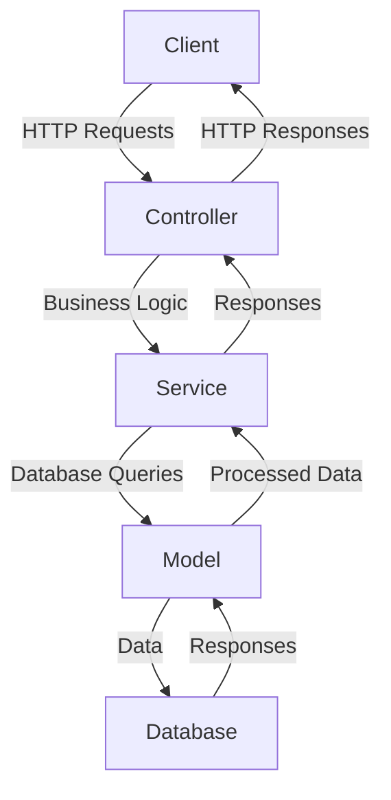
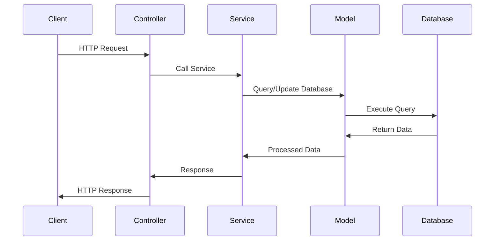

# Sample Node.js Application

This document provides an overview of a sample Node.js application, including its architecture and workflow. The document also includes mermaid diagrams to visualize the application's structure and processes.

## Application Overview

The sample Node.js application is a RESTful API that allows users to manage tasks. It includes the following features:
- User authentication
- CRUD operations for tasks
- Error handling and logging

## Architecture

The application follows a typical MVC (Model-View-Controller) architecture. Below is a mermaid diagram illustrating the architecture:

## Workflow

The workflow of the application is as follows:
1. The client sends an HTTP request to the API.
2. The controller processes the request and calls the appropriate service.
3. The service interacts with the model to query or update the database.
4. The model communicates with the database and returns the data to the service.
5. The service processes the data and sends it back to the controller.
6. The controller sends the response to the client.

Below is a mermaid sequence diagram illustrating the workflow:

## References

- [Node.js Official Documentation](https://nodejs.org/en/docs/)
- [Express.js Guide](https://expressjs.com/)
- [Mermaid.js Documentation](https://mermaid-js.github.io/mermaid/)
- [MVC Architecture Overview](https://en.wikipedia.org/wiki/Model%E2%80%93view%E2%80%93controller)
